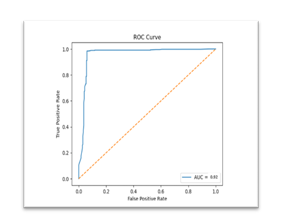

# Cyberbullying Detection Using Machine Learning
### Research-Oriented ML Project for Harmful Content Identification

---

## Project Overview

Cyberbullying on online platforms has become a major social issue affecting mental health and digital safety. This project proposes a Machine Learning based approach for automatically identifying cyberbullying text using NLP preprocessing, TF-IDF feature extraction, and classification algorithms.

The project was developed as part of ongoing academic research work focused on improving harmful content detection and supporting safer online environments.

---

## Research Objective

The main objectives of this work are:

- Detect cyberbullying content automatically
- Compare machine learning algorithms for classification
- Improve online safety using AI techniques
- Analyze model performance using evaluation metrics
- Explore future transformer-based approaches

---

## Problem Statement

Manual moderation of harmful online content is difficult because of:

- Large volume of user-generated text
- Hidden abusive language patterns
- Context-dependent bullying behavior
- Need for scalable automated systems

This project attempts to address these challenges through Machine Learning techniques.

---

# Methodology / Workflow

The workflow followed in this research:

1. Data Collection  
2. Data Cleaning & Preprocessing  
3. Tokenization & Stopword Removal  
4. Feature Extraction using TF-IDF  
5. Model Training  
6. Performance Evaluation  
7. Result Comparison  

---

## System Workflow

Add workflow image here:

---

# Technologies Used

| Category | Tools |
|---------|------|
| Programming | Python |
| ML Libraries | Scikit-learn, Pandas, NumPy |
| NLP | TF-IDF, Text Preprocessing |
| Visualization | Matplotlib |
| Documentation | Overleaf, IEEE Format |
| Version Control | GitHub |

---

# Dataset Information

Dataset Source:

(Add dataset source here)

Example:

- Kaggle Dataset
- Twitter Dataset
- Public cyberbullying dataset

Preprocessing performed:

✔ Text cleaning  
✔ Lowercasing  
✔ Stopword removal  
✔ Tokenization  
✔ Feature extraction using TF-IDF  

---

# Models Implemented

### 1. Support Vector Machine (SVM)

Used for text classification and achieved the highest performance among tested models.

### 2. Logistic Regression

Implemented for comparison against SVM.

---

# Model Performance

---

## PERFORMANCE COMPARISON OF MACHINE LEARNING MODELS

---

## Confusion Matrix

---

## ROC Curve

 

---

# System Architecture of the Proposed Cyberbullying Detection Frame
work

 

---
   
# Key Findings

- SVM showed better performance for cyberbullying classification.
- TF-IDF effectively represented textual features.
- Model evaluation indicates potential for real-world moderation systems.

---

# Future Work

Possible improvements include:

- Transformer Models (BERT)
- Multilingual BERT
- Deep Learning Approaches
- LLM Integration
- Real-time API Deployment
- Context-aware classification

Future research can improve scalability and multilingual understanding.

---

# Research Contribution

This work involved:

- Literature review
- Experiment design
- Data preprocessing
- Model comparison
- Evaluation metric analysis
- Research writing
- Collaborative paper preparation

---

# Research Status

**Current Status:**  
Research paper under conference submission.

*(Paper not yet published.)*

---

# Conference & Academic Exposure

Research related exposure includes:

- Participation in International Conference on AI-Driven Innovations and Applications (IC-AIDA 2026)
- Experience with IEEE conference workflow
- Academic writing using Overleaf
- Exposure to research documentation standards

---
# Author

**Siddiqua Fathima**  
MCA | AI & ML Enthusiast | Research Learner

GitHub: https://github.com/siddiquafathima

LinkedIn:
https://www.linkedin.com/in/siddiqua-fathima-126b98212

---

# Disclaimer

This repository supports ongoing academic research and learning purposes.
